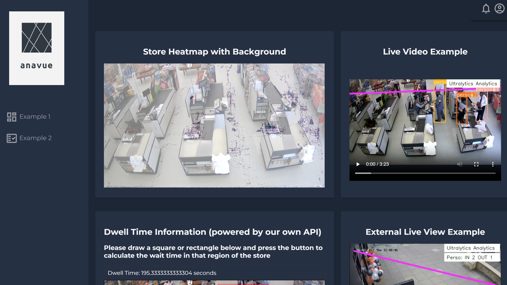

# anavue
Software that allows high-ticket item store managers (e.g. jewelry boutiques) to review advanced data within their store such as: foot traffic at different times, likely customer paths, dwell times, queue times, employee closing rates, etc. by overlaying our program over their security footage and tracking objects/generating heatmaps.

In more detail:

*Using video analytics of surveillance footage driven by AI, we are creating a comprehensive data tool for high ticket retailers. Like Shopify customer analytics but for in person retail stores. 

*We give managers a remote view of a store’s performance by tracking Key Performance Indicators such as: 

- Foot-traffic and likely customer paths, Peak times 

- Probability paths, Dwell time, Queue times, Heatmaps (in-store customer distribution) 

- Employee productivity, their interactions and close rate (Sales/Customers Engaged) 

- Point of Sale integration for live updates, revenue, and profit 

*We eliminate the need for store-managers to work full-time as well as reducing reliance on anecdotal evidence. 

*With more data, we will deliver both descriptive analytics and predictive analytics to help our customers cut costs and increase revenue. 

*Distribution is key – making data we provide easy to understand and implement in your store is something we will continuously work on and equally important as the data itself. 

*Maintaining privacy for our customers especially in our sector is crucial, that’s why we will allow our customers to integrate their surveillance footage directly into our secure network, allowing them to manage their business intelligence and security needs on one platform.
