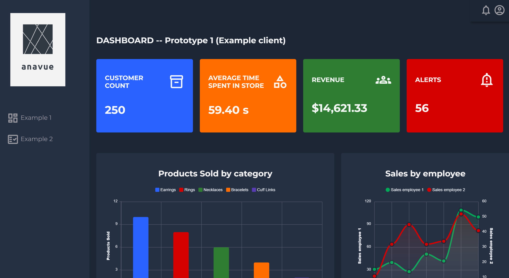

# anavue
Software that allows high-ticket item store managers (e.g. jewelry boutiques) to review advanced data within their store such as: foot traffic at different times, likely customer paths, dwell times, queue times, employee closing rates, etc. by overlaying our program over their security footage and tracking objects/generating heatmaps.

